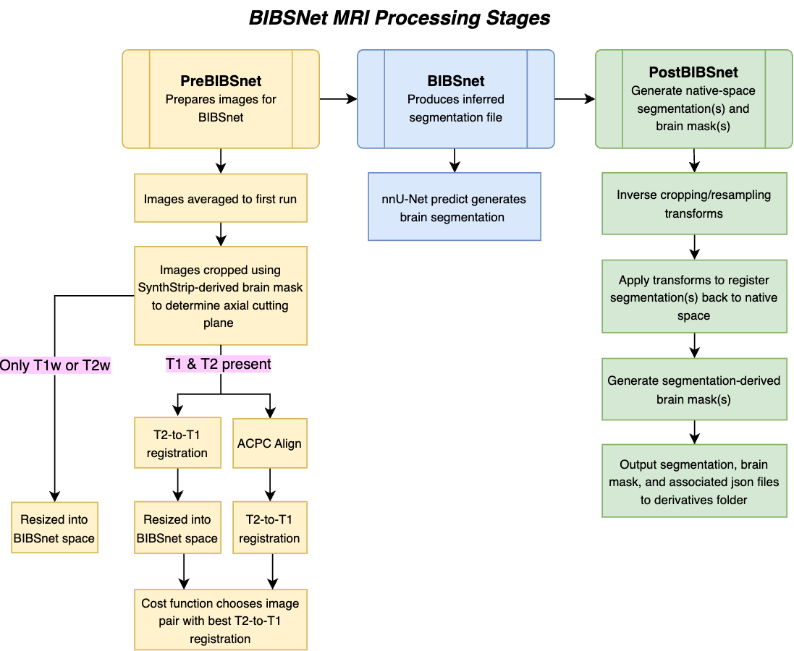

# BIBSnet

We introduce BIBSNet (Baby and Infant Brain Segmentation Neural Network), an open-source, community-driven deep learning model. Provided as a [BIDS App](https://bids-apps.neuroimaging.io/about/) container, BIBSNet leverages data augmentation and a large, manually annotated infant dataset to produce robust and generalizable brain segmentations. The model outputs native-space brain segmentations, brain masks, and sidecar JSON files as [BIDS derivatives](https://bids-specification.readthedocs.io/en/stable/derivatives/introduction.html).

[BIBSnet Github Repository](https://github.com/DCAN-Labs/BIBSnet) 
[BIBSnet dockerhub Repository](https://hub.docker.com/repository/docker/dcanumn/bibsnet/)

-------------------

## Background & Significance

From [Hendrickson et al. 2023](https://doi.org/10.1101/2023.03.22.533696):

>***Objectives:*** *Brain segmentation of infant magnetic resonance (MR) images is vitally important in studying developmental mental health and disease. The infant brain undergoes many changes throughout the first years of postnatal life, making tissue segmentation difficult for most existing algorithms. Here, we introduce a deep neural network BIBSNet (Baby and Infant Brain Segmentation Neural Network), an open-source, community-driven model that relies on data augmentation and a large sample size of manually annotated images to facilitate the production of robust and generalizable brain segmentations.*

>***Experimental Design:*** *Included in model training and testing were MR brain images on 84 participants with an age range of 0-8 months (median postmenstrual ages of 13.57 months). Using manually annotated real and synthetic segmentation images, the model was trained using a 10-fold cross-validation procedure. Testing occurred on MRI data processed with the DCAN labs infant-ABCD-BIDS processing pipeline using segmentations produced from gold standard manual annotation, joint-label fusion (JLF), and BIBSNet to assess model performance.*

>***Principal Observations:*** *Using group analyses, results suggest that cortical metrics produced using BIBSNet segmentations outperforms JLF segmentations. Additionally, when analyzing individual differences, BIBSNet segmentations perform even better.*

>***Conclusions:*** *BIBSNet segmentation shows marked improvement over JLF segmentations across all age groups analyzed. The BIBSNet model is 600x faster compared to JLF and can be easily included in other processing pipelines.*

-------------------

## BIBSNet Model Training

The BIBSNet model was trained using the nnU-Net framework ([Isensee et al., 2021](https://doi.org/10.1038/s41592-020-01008-z)), incorporating a large dataset of manually annotated infant MRI scans. To enhance robustness across scanners and acquisition parameters, data augmentation was applied using [SynthSeg](https://surfer.nmr.mgh.harvard.edu/fswiki/SynthSeg).  

Full methodological details of the training procedure are described in [Hendrickson et al., 2023](https://doi.org/10.1101/2023.03.22.533696).

BIBSNet models are periodically retrained to include new data spanning a wider range of ages and datasets. The information below pertains to the training dataset used for the most recent model release (**v3.6.0**).

### BIBSNet Model v3.6.0

BIBSNet contains three separate models trained specifically for a given modality. There is a T1-only, T2-only, and T1+T2 model that are leveraged for nnUNet_predict automatically depending upon a users input data. The most up to date models in v3.6.0 use a more robust training dataset than in previous versions, using a combination of anatomical T1w/T2w images and gold standard segmentations from both the HBCD study and the BOBS repository ([Feczko et al., 2024](https://doi.org/10.1101/2024.10.02.616147)). 1000 image/segmentation pairs for a given age in months are then augmented with SynthSeg to further enhance the training datasets. nnUNet then uses a 5-fold training approach, and the best model from the five folds gets ingested into BIBSNet for each modality, and leveraged for nnUNet_predict. Below is a table outlining the training datasets for each model:

|      | T1-only model | T2-only model | T1+T2 model |
| :--- | :-----------: | :-----------: | :---------: |
| T1 count (BOBS/HBCD/Total) | 102/961/1063 | 0/0/0 | 102/318/420 |
| T2 count (BOBS/HBCD/Total) | 0/0/0 | 176/338/514 | 102/318/420 |
| Segmentation count (BOBS/HBCD/Total) | 102/961/1063 | 176/338/514 | 102/318/420 |
| Augmentation count (images/segs) | 12000/12000 | 9000/9000 | 18000/9000 |
| Age range | 0-10, 13mo | 0-8mo | 0-8mo |

## Pipeline Workflow

### Stage 1 - PreBIBSnet 

Prepares the input T1-weighted and/or one T2-weighted structural MRI image(s) for BIBSNet:      

* T1w and T2w images are renamed to fit nnU-Net naming conventions (_0000 and _0001 respectively) and if there are multiple T1w or T2w, they are registered to the first run and averaged
* The neck and shoulders are cropped from the average images using a [SynthStrip](https://surfer.nmr.mgh.harvard.edu/docs/synthstrip/)-derived brain mask to identify the optimal axial cropping plane
* T2w-to-T1w registration is performed via multiple workflows (either directly or following ACPC-alignment of both T1w and T2w), eta-squared is used to choose the optimal registration method, and the resulting best pair is fed into the next stage for segmentation

### Stage 2 - BIBSnet
Quickly and accurately segments an optimally-aligned T1 and T2 pair with a deep neural network trained via nnU-Net and SynthSeg with 0-8 month old infant MRI brain dataset.

### Stage 3 - PostBIBSnet
Transforms segmentation back to native space for both T1w and T2w, generates brain masks derived from the segmentation, and creates derivative outputs including sidecar jsons. The working directories for pre- through postBIBSNet are removed if user did not specify a working directory.

-------------------

## How to Cite
Please acknowledge this work using the citation listed on the [Zenodo page](https://zenodo.org/records/13743295). There is a "Citation" section in the right-hand sidebar where you can select the citation format, e.g. APA style:
> Houghton, A., Conan, G., Hendrickson, T. J., Alexopoulos, D., Goncalves, M., Koirala, S., Latham, A., Lee, E., Lundquist, J., Madison, T. J., Markiewicz, C. J., Moore, L. A., Moser, J., Reiners, P., Rueter, A., Barry J. Tikalsky, Fair, D. A., & Feczko, E. (2024). BIBSnet (3.4.2). Zenodo. [https://doi.org/10.5281/zenodo.13743295](https://doi.org/10.5281/zenodo.13743295)

Please also acknowledge the associated publication for this tool:

>Hendrickson TJ, Reiners P, Moore LA, Perrone AJ, Alexopoulos D, Lee E, Styner M, Kardan O, Chamberlain TA, Mummaneni A, Caldas HA, Bower B, Stoyell S, Martin T, Sung S, Fair E, Uriarte-Lopez J, Rueter AR, Rosenberg MD, Smyser CD, Elison JT, Graham A, Fair DA, Feczko E. (2023). BIBSNet: A Deep Learning Baby Image Brain Segmentation Network for MRI Scans. BioRxiv, 2023.03.22.533696. [https://doi.org/10.1101/2023.03.22.533696](https://doi.org/10.1101/2023.03.22.533696)