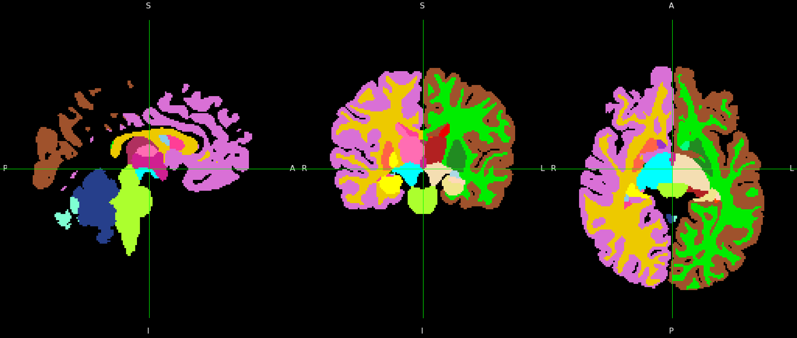

# Testing
To test BIBSNet to ensure it's working as expected:

Install `openneuro-py` on the command line (e.g. `pip install openneuro-py`) and use it to download test data from [OpenNeuro](https://openneuro.org/), e.g.: 
```
# Python
from pathlib import Path
import openneuro

Path("./ds004776").mkdir()
openneuro.download(dataset="ds004776", target_dir="./ds004776", include="sub-01")
```

Build the BIBSNet container on the command line (`singularity pull bibsnet.sif docker://dcanumn/bibsnet:latest`) and execute with the test data, e.g.:
```
# bash

mkdir derivatives

singularity run --nv --cleanenv --no-home \
	-B /path/to/ds004776:/input \
	-B /path/to/derivatives:/output \
	/path/to/bibsnet.sif \
	/input /output participant \
	-participant 01 \
```

Ensure that the application runs without error and that the expected outputs are produced (see [Outputs](outputs.md)). For good measure, visually inspect the segmentation generated. Here is a snapshot view of the brain segmentation generated by this test subject:


